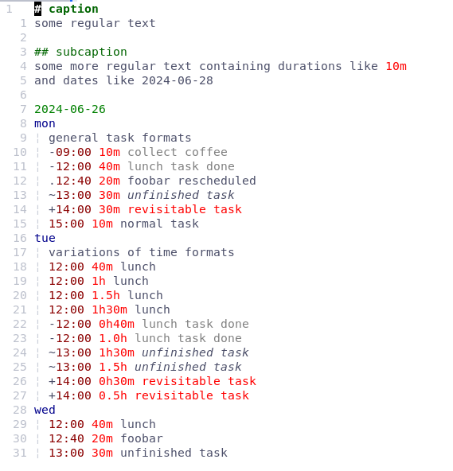

# vim-tmblk

This plugin provides syntax highlighting for `.tbk` files in Vim and Neovim
in order to do timeblocking within your favorite editor.

## Example



## Installation

### Using vim-plug

Add the following to your `~/.vimrc` or `~/.config/nvim/init.vim`:

```vim
call plug#begin('~/.vim/plugged')
Plug 'sdx23/vim-tmblk'
call plug#end()
```

### Using lazy.nvim
Add the following to your init.lua:

```lua
require('lazy').setup({
  {
    'sdx23/vim-tmblk',
    config = function()
      vim.cmd('au BufRead,BufNewFile *.tbk set filetype=tbk')
    end,
    ft = 'tbk',
  },
})
```
